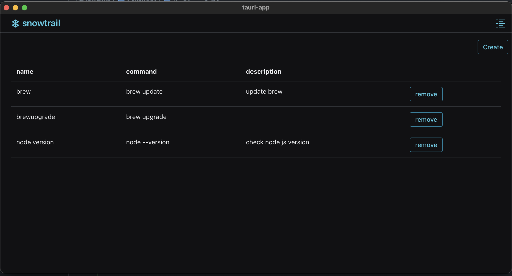

# snowtrail
Command Manager

This is my experiment in creating desktop apps using Tauri.

## モチベーション
- tauri アプリを作ってみたかった
- 不定期に実行したいコマンドがあるが毎回コマンドを打つのは面倒。アプリで管理したい

## アプリケーション仕様
- コマンドを登録できる
- 登録したコマンドを実行できる
- コマンドの実行ログ (stdout/stderr) を確認できる
- コマンドを削除できる

## キャプチャ


コマンドの実行はシステムトレイ(メニュー)から行える。  
コマンドを実行するというアプリケーションの特性上、常時起動を想定しており、ウィンドウがあると邪魔なのでシステムトレイにした記憶。

## Stacks
- tauri
- react
- vite
- react router

## Local Development
tauri-cli を pnpm でインストールしており pnpm dev でアプリケーションが立ち上がる  
tauri-cli は内部的に cargo run をしてくれるので、cargo を気にする必要はない  

```bash
pnpm dev
```
